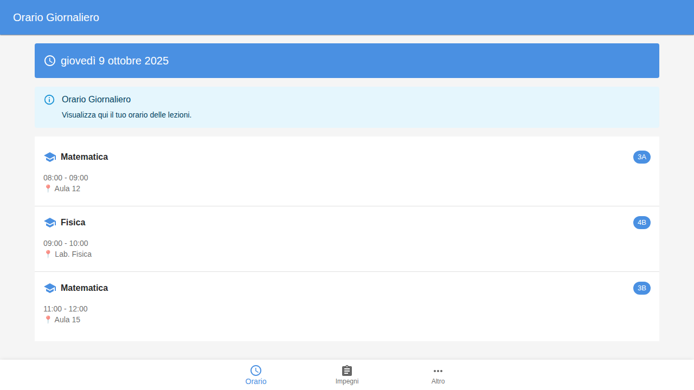
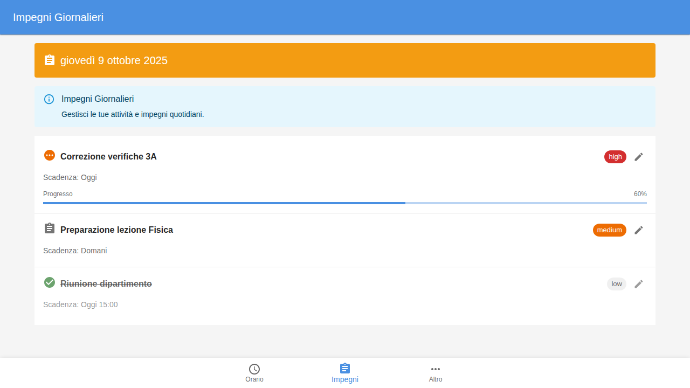
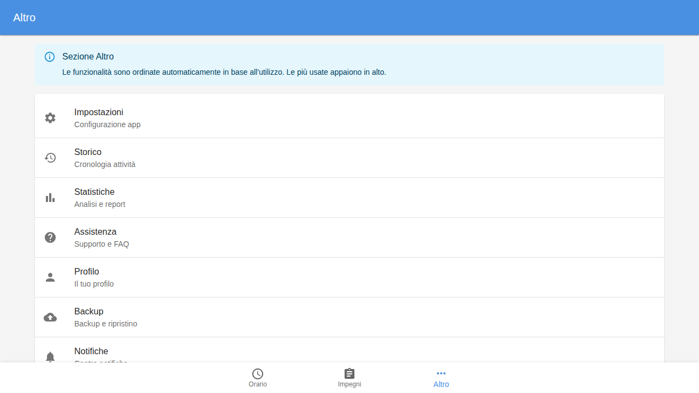
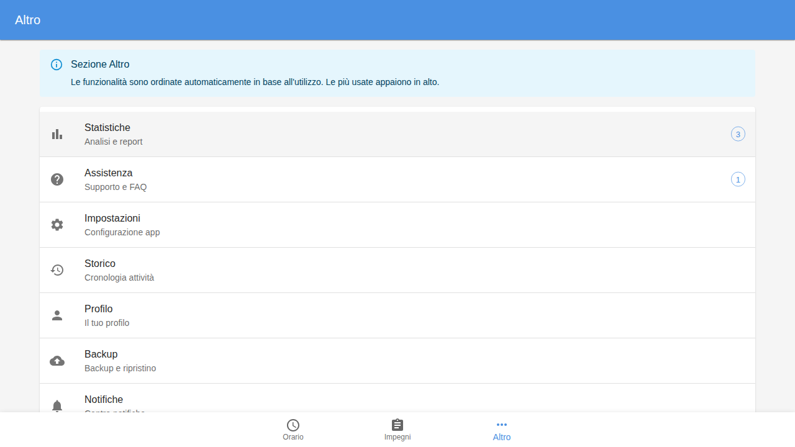
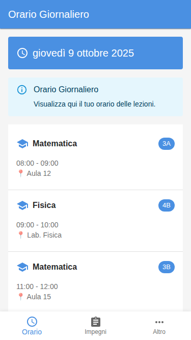

# 📸 Screenshots - UI Material UI Post-Login

Questa directory contiene gli screenshots dell'interfaccia Material UI post-login.

## 📱 Screenshots Disponibili

### 1. react-app-orario.png
**Sezione**: Orario Giornaliero 📅

Mostra:
- AppBar con titolo sezione
- Data corrente (italiano)
- Lista lezioni con:
  - Icona materia
  - Nome materia
  - Chip classe
  - Orario
  - Aula



---

### 2. react-app-impegni.png
**Sezione**: Impegni Giornalieri 📋

Mostra:
- Lista attività con:
  - Icone stato (pending, in-progress, completed)
  - Titoli attività
  - Chip priorità (high, medium, low)
  - Date scadenza
  - Progress bars per attività in corso
  - Pulsanti edit



---

### 3. react-app-altro.png
**Sezione**: Altro ⚙️

Mostra:
- Alert informativo sull'ordinamento automatico
- Lista funzionalità:
  - Impostazioni
  - Storico
  - Statistiche
  - Assistenza
  - Profilo
  - Backup
  - Notifiche
  - Info App



---

### 4. react-app-altro-usage-ordering.png
**Sezione**: Altro - Usage-Based Ordering Demo 🎯

Mostra:
- **Statistiche** con chip "3" (più usata, in cima)
- **Assistenza** con chip "1" (seconda)
- Ordinamento automatico basato sui click
- Persistenza contatori



---

### 5. react-app-mobile.png
**Vista Mobile** 📱 (375px)

Mostra:
- Layout responsive mobile
- BottomNavigation ben visibile
- Container adattato
- Scroll verticale
- Touch-friendly design



---

## 🎨 Tema Colori Visibile

Negli screenshot puoi vedere:
- **Primary Blue** (#4a90e2): AppBar, chip, link
- **Secondary Orange** (#f39c12): Impegni header
- **Background Gray** (#f5f5f5): Sfondo app
- **White** (#ffffff): Cards e liste

## 🔍 Come Riprodurre

```bash
# 1. Installa dipendenze
npm install

# 2. Avvia dev server
npm run dev

# 3. Apri browser
http://localhost:5173/app-react.html

# 4. Naviga tra le sezioni usando BottomNavigation

# 5. Testa usage ordering:
#    - Vai su "Altro"
#    - Clicca varie funzionalità
#    - Osserva riordinamento
```

## 📊 Risoluzione Screenshots

- **Desktop**: 1280x720 (standard laptop)
- **Mobile**: 375x667 (iPhone SE)

## 🔄 Aggiornamento Screenshots

Per aggiornare gli screenshots:

```bash
# 1. Avvia app
npm run build
cd dist && python3 -m http.server 8080

# 2. Usa browser dev tools o Playwright
# 3. Salva in docs/screenshots/
# 4. Commit changes
```

---

**Ultimo Aggiornamento**: 9 Gennaio 2025  
**Tool**: Playwright Browser Automation  
**Browser**: Chromium
